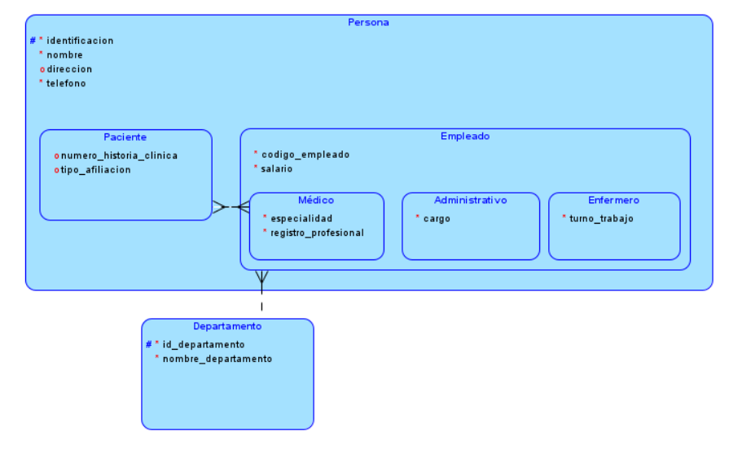
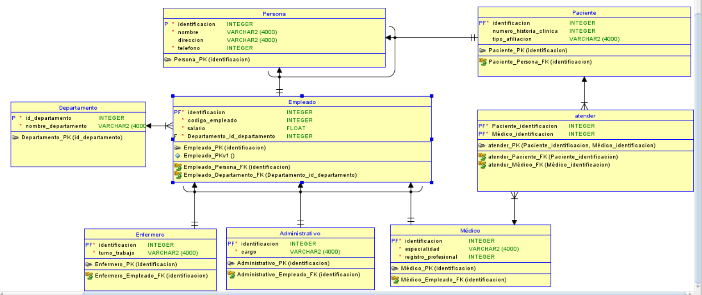

# Taller Herencia de Atributos
 
## Punto 1 

# Generalización / Especialización del Modelo Entidad-Relación

## 1. Identificación de la superclase y las subclases

El modelo presenta **dos niveles de generalización/especialización**.

### Nivel 1

- **Superclase:** `Persona`
- **Subclases:**
  - `Paciente`
  - `Empleado`

### Nivel 2 (especialización de `Empleado`)

- **Superclase:** `Empleado`
- **Subclases:**
  - `Médico`
  - `Enfermero`
  - `Administrativo`

---

## 2. Atributos heredados y atributos propios

### Atributos heredados (definidos en `Persona`)

Estos atributos son heredados por `Paciente` y `Empleado`, y de forma transitiva por `Médico`, `Enfermero` y `Administrativo`.

- `identificacion`
- `nombre`
- `direccion`
- `telefono`

### Atributos propios de `Paciente`

- `numero_historia_clinica`
- `tipo_afiliacion`

### Atributos propios de `Empleado`

Estos atributos también son heredados por `Médico`, `Enfermero` y `Administrativo`.

- `codigo_empleado`
- `salario`

### Atributos propios de `Médico`

- `especialidad`
- `registro_profesional`

### Atributos propios de `Enfermero`

- `turno_trabajo`

### Atributos propios de `Administrativo`

- `cargo`

---

## 3. Diagrama Entidad-Relación con generalización/especialización

El diagrama fue desarrollado en **Oracle SQL Developer Data Modeler** (ver imagen adjunta) e incluye los siguientes elementos:

- **`Persona`** como superclase.
- **`Paciente`** y **`Empleado`** como subclases de primer nivel.
- **`Empleado`** como superclase de segundo nivel, especializada en:
  - `Médico`
  - `Enfermero`
  - `Administrativo`
- La entidad **`Departamento`**, relacionada con `Empleado` mediante la relación **"trabaja en"**, donde un departamento puede tener varios empleados.
- La entidad asociativa **`Atender`**, que resuelve la relación **muchos a muchos (M:N)** entre `Médico` y `Paciente`, ya que:
  - Un médico puede atender a varios pacientes.
  - Un paciente puede ser atendido por varios médicos.

---

## 4. Tipo de especialización

### Persona → Paciente / Empleado

- **Tipo:** Solapada (*Overlapping*)

**Justificación:**

El enunciado establece explícitamente que **una misma persona puede ser simultáneamente paciente y empleado del hospital**. Esto implica que una instancia de `Persona` puede pertenecer a ambas subclases al mismo tiempo, sin exclusión mutua.

En el modelo, esto se representa mediante dos jerarquías de subtipo independientes (sin un arco de exclusividad), de forma que `Paciente` y `Empleado` poseen cada uno su propia clave foránea hacia `Persona`, sin una columna discriminadora que obligue a seleccionar un único subtipo.

### Empleado → Médico / Enfermero / Administrativo

- **Tipo:** Disjunta (*Disjoint*)

**Justificación:**

Un empleado ocupa un único rol dentro del hospital: **Médico**, **Enfermero** o **Administrativo**. Aunque esta restricción no se expresa literalmente en el enunciado, se deduce de la naturaleza excluyente de los cargos y de que cada uno posee atributos específicos.

En el modelo, esta restricción se implementa mediante una **columna discriminadora**, que permite asignar un solo subtipo a cada registro de `Empleado`.

---

## 5. Tipo de generalización

### Persona → Paciente / Empleado

- **Tipo:** Parcial

**Justificación:**

No toda instancia de `Persona` debe pertenecer necesariamente a las subclases `Paciente` o `Empleado`. El enunciado no exige que todas las personas registradas en el sistema desempeñen alguno de esos roles; por ejemplo, podría registrarse un acompañante o un contacto de emergencia.

En el modelo, esto se refleja al **no marcar la opción _Complete Subtypes_ (Subtipos Completados)** para la entidad `Persona`.

### Empleado → Médico / Enfermero / Administrativo

- **Tipo:** Total

**Justificación:**

Todo empleado debe pertenecer obligatoriamente a una de las tres especializaciones definidas: **Médico**, **Enfermero** o **Administrativo**. Son los únicos roles contemplados para el personal del hospital.

En el modelo, esto se representa marcando la opción **_Complete Subtypes_ (Subtipos Completados)** para `Empleado`, junto con una **columna discriminadora** que obliga a asignar uno de los tres subtipos a cada empleado registrado.

## SQL 

CREATE TABLE Administrativo 
    ( 
     identificacion INTEGER  NOT NULL , 
     cargo          VARCHAR2 (4000)  NOT NULL 
    ) 
;

ALTER TABLE Administrativo 
    ADD CONSTRAINT Administrativo_PK PRIMARY KEY ( identificacion ) ;

CREATE TABLE atender 
    ( 
     Paciente_identificacion INTEGER  NOT NULL , 
     Médico_identificacion   INTEGER  NOT NULL 
    ) 
;

ALTER TABLE atender 
    ADD CONSTRAINT atender_PK PRIMARY KEY ( Paciente_identificacion, Médico_identificacion ) ;

CREATE TABLE Departamento 
    ( 
     id_departamento     INTEGER  NOT NULL , 
     nombre_departamento VARCHAR2 (4000)  NOT NULL 
    ) 
;

ALTER TABLE Departamento 
    ADD CONSTRAINT Departamento_PK PRIMARY KEY ( id_departamento ) ;

CREATE TABLE Empleado 
    ( 
     identificacion               INTEGER  NOT NULL , 
     codigo_empleado              INTEGER  NOT NULL , 
     salario                      FLOAT  NOT NULL , 
     Departamento_id_departamento INTEGER  NOT NULL 
    ) 
;

ALTER TABLE Empleado 
    ADD CONSTRAINT Empleado_PK PRIMARY KEY ( identificacion ) ;

-- Error - Unique Constraint Empleado.Empleado_PKv1 doesn't have columns

CREATE TABLE Enfermero 
    ( 
     identificacion INTEGER  NOT NULL , 
     turno_trabajo  VARCHAR2 (4000)  NOT NULL 
    ) 
;

ALTER TABLE Enfermero 
    ADD CONSTRAINT Enfermero_PK PRIMARY KEY ( identificacion ) ;

CREATE TABLE Médico 
    ( 
     identificacion       INTEGER  NOT NULL , 
     especialidad         VARCHAR2 (4000)  NOT NULL , 
     registro_profesional INTEGER  NOT NULL 
    ) 
;

ALTER TABLE Médico 
    ADD CONSTRAINT Médico_PK PRIMARY KEY ( identificacion ) ;

CREATE TABLE Paciente 
    ( 
     identificacion          INTEGER  NOT NULL , 
     numero_historia_clinica INTEGER , 
     tipo_afiliacion         VARCHAR2 (4000) 
    ) 
;

ALTER TABLE Paciente 
    ADD CONSTRAINT Paciente_PK PRIMARY KEY ( identificacion ) ;

CREATE TABLE Persona 
    ( 
     identificacion INTEGER  NOT NULL , 
     nombre         VARCHAR2 (4000)  NOT NULL , 
     direccion      VARCHAR2 (4000) , 
     telefono       INTEGER  NOT NULL 
    ) 
;

ALTER TABLE Persona 
    ADD CONSTRAINT Persona_PK PRIMARY KEY ( identificacion ) ;

ALTER TABLE Administrativo 
    ADD CONSTRAINT Administrativo_Empleado_FK FOREIGN KEY 
    ( 
     identificacion
    ) 
    REFERENCES Empleado 
    ( 
     identificacion
    ) 
;

ALTER TABLE atender 
    ADD CONSTRAINT atender_Médico_FK FOREIGN KEY 
    ( 
     Médico_identificacion
    ) 
    REFERENCES Médico 
    ( 
     identificacion
    ) 
;

ALTER TABLE atender 
    ADD CONSTRAINT atender_Paciente_FK FOREIGN KEY 
    ( 
     Paciente_identificacion
    ) 
    REFERENCES Paciente 
    ( 
     identificacion
    ) 
;

ALTER TABLE Empleado 
    ADD CONSTRAINT Empleado_Departamento_FK FOREIGN KEY 
    ( 
     Departamento_id_departamento
    ) 
    REFERENCES Departamento 
    ( 
     id_departamento
    ) 
;

ALTER TABLE Empleado 
    ADD CONSTRAINT Empleado_Persona_FK FOREIGN KEY 
    ( 
     identificacion
    ) 
    REFERENCES Persona 
    ( 
     identificacion
    ) 
;

ALTER TABLE Enfermero 
    ADD CONSTRAINT Enfermero_Empleado_FK FOREIGN KEY 
    ( 
     identificacion
    ) 
    REFERENCES Empleado 
    ( 
     identificacion
    ) 
;

ALTER TABLE Médico 
    ADD CONSTRAINT Médico_Empleado_FK FOREIGN KEY 
    ( 
     identificacion
    ) 
    REFERENCES Empleado 
    ( 
     identificacion
    ) 
;

ALTER TABLE Paciente 
    ADD CONSTRAINT Paciente_Persona_FK FOREIGN KEY 
    ( 
     identificacion
    ) 
    REFERENCES Persona 
    ( 
     identificacion
    ) 
;

--  ERROR: No Discriminator Column found in Arc FKArc_1 - constraint trigger for Arc cannot be generated 

--  ERROR: No Discriminator Column found in Arc FKArc_1 - constraint trigger for Arc cannot be generated 

--  ERROR: No Discriminator Column found in Arc FKArc_1 - constraint trigger for Arc cannot be generated

--  ERROR: No Discriminator Column found in Arc FKArc_2 - constraint trigger for Arc cannot be generated 

--  ERROR: No Discriminator Column found in Arc FKArc_2 - constraint trigger for Arc cannot be generated

