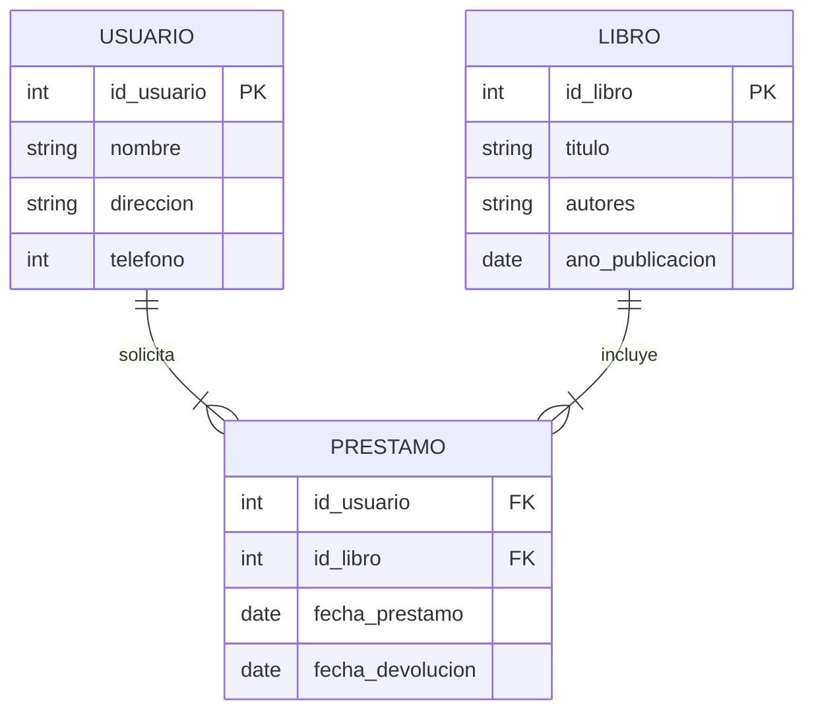
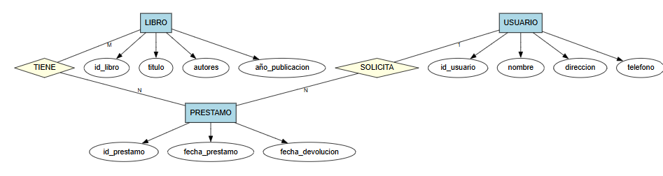
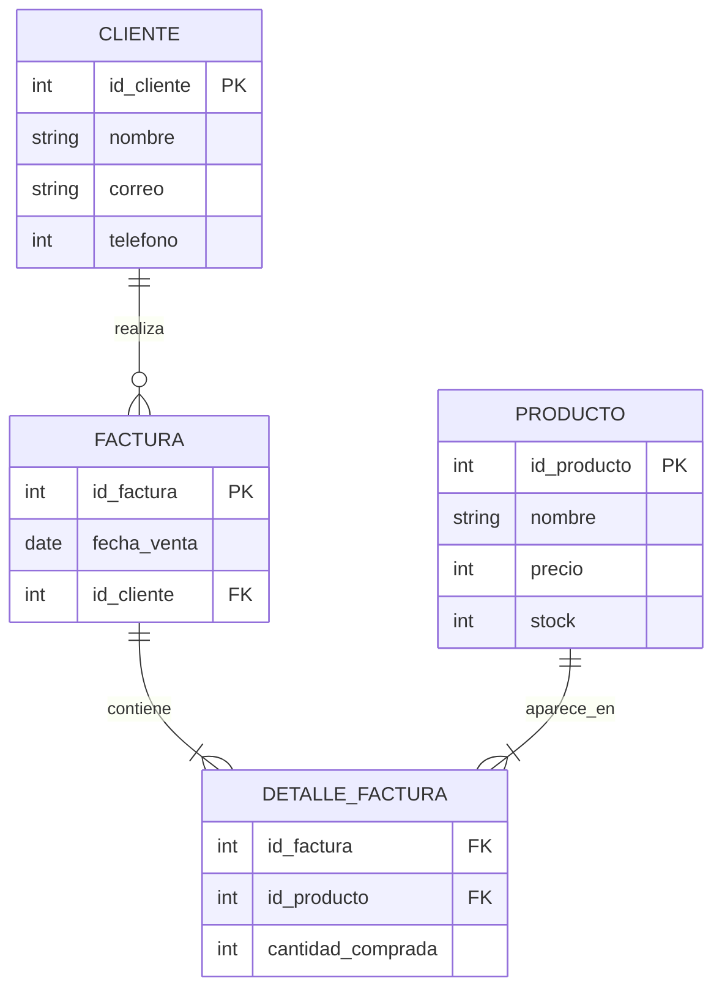
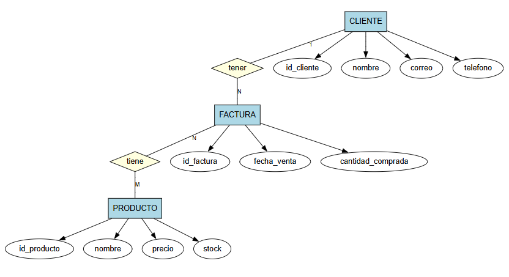
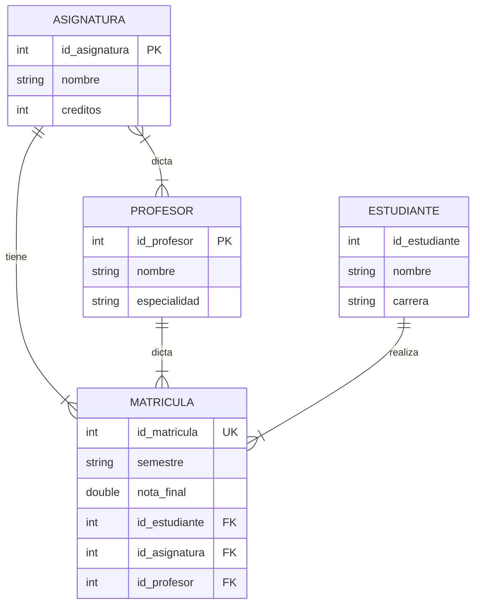
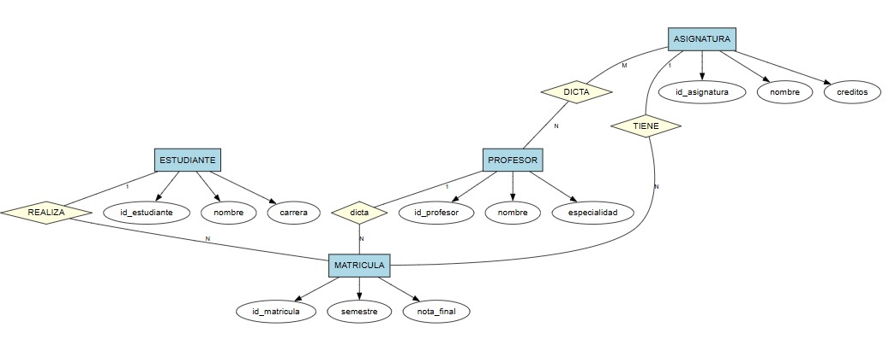

# Taller de Modelo Entidad Relación

## 1. Biblioteca

## 2. Compra

FACTURA es la entidad asociativa porque resuelve la relación muchos a muchos (M:N) entre CLIENTE y PRODUCTO, descomponiéndola en dos relaciones 1:N (CLIENTE–FA…FACTURA es la entidad asociativa porque resuelve la relación muchos a muchos (M:N) entre CLIENTE y PRODUCTO, descomponiéndola en dos relaciones 1:N (CLIENTE–FACTURA y FACTURA–PRODUCTO). Además, la venta tiene atributos propios (número de factura, fecha y cantidad comprada) que no pertenecen ni al cliente ni al producto, sino a la transacción en sí, por lo que esa relación debe modelarse como entidad. Su clave primaria compuesta (id_cliente + id_producto, ambas FK) permite registrar cada compra específica con su cantidad correspondiente.

## 3. Universidad

    
¿Relación binaria o ternaria?
En este modelo existe una relación ternaria, conformada por ESTUDIANTE, ASIGNATURA y PROFESOR, las cuales convergen en la entidad asociativa MATRICULA. Esto se debe a que cada registro de matrícula no depende de solo dos entidades, sino de la combinación simultánea de las tres: un estudiante específico, cursando una asignatura específica, con un profesor específico (ya que una misma asignatura puede ser impartida por varios profesores, por lo que es necesario saber con cuál de ellos la cursó el estudiante). Además, persiste una relación binaria M:N entre ASIGNATURA y PROFESOR, ya que un profesor puede impartir varias asignaturas y una asignatura puede ser impartida por varios profesores, independientemente de las matrículas.
