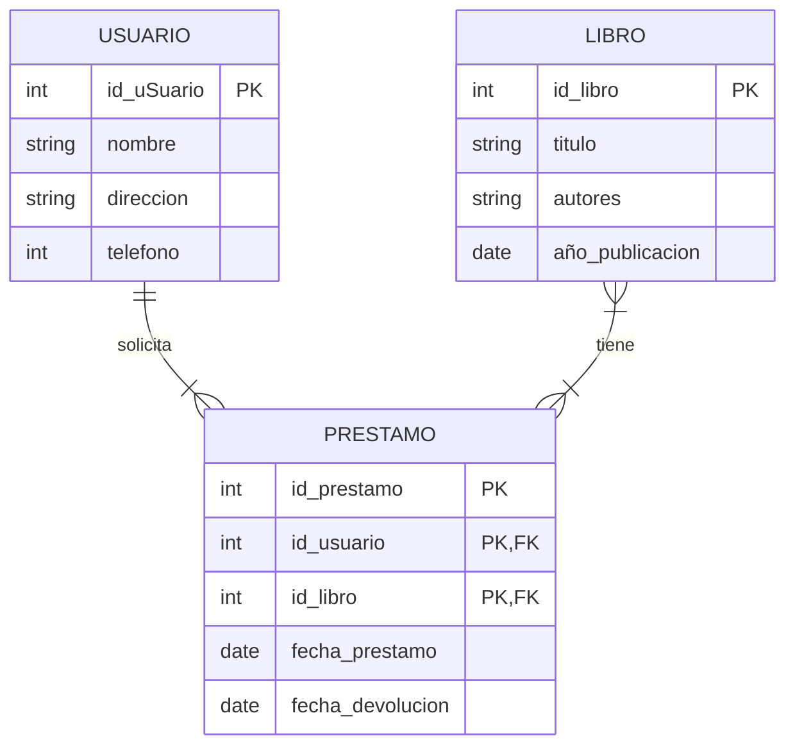
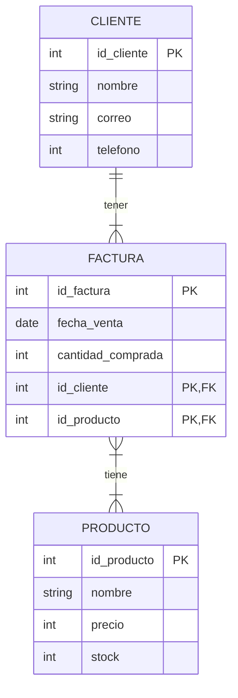

## Biblioteca

```mermaid
erDiagram
	direction TB
	LIBRO {
		int id_libro PK ""  
		string titulo  ""  
		string autores  "" 
    date año_publicacion 
	}

	USUARIO {
		int id_uSuario PK ""  
		string nombre  ""  
		string direccion  ""  
		int telefono  ""  
	}

	PRESTAMO {
		int id_prestamo PK ""  
		int id_usuario PK, FK ""  
		int id_libro PK, FK ""  
		date fecha_prestamo  ""  
		date fecha_devolucion  ""  
	}

    USUARIO ||--|{ PRESTAMO : solicita
    LIBRO }|--|{ PRESTAMO : tiene 
```

## Compra

```mermaid
erDiagram
	direction TB
	PRODUCTO {
		int id_producto PK ""  
		string nombre  ""  
		int precio  "" 
    int stock
	}

	CLIENTE {
		int id_cliente PK ""  
		string nombre  ""  
		string correo  ""  
		int telefono  ""  
	}

	FACTURA {
		int id_factura PK ""  
		date fecha_venta  ""  
		int cantidad_comprada ""  
    int id_cliente PK, FK
    int id_producto PK, FK
	}

    CLIENTE ||--|{ FACTURA : tener
    FACTURA }|--|{ PRODUCTO : tiene 
```   
    
