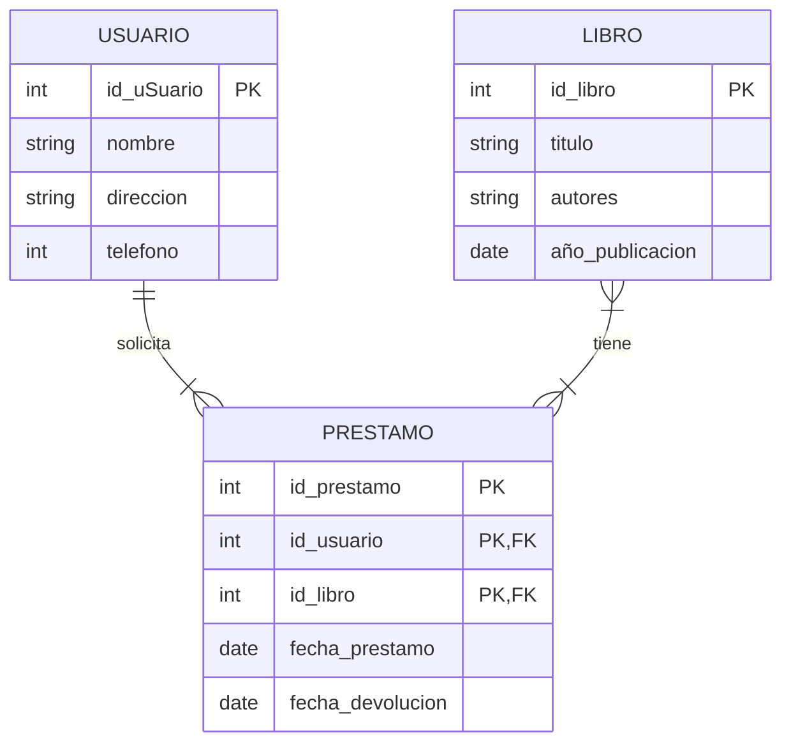
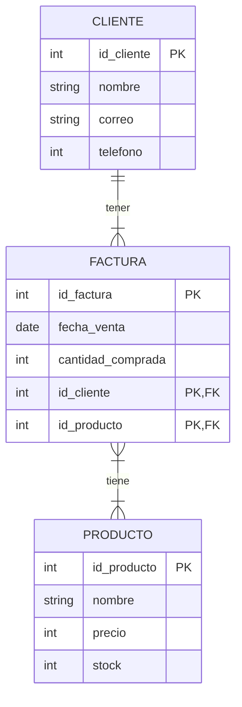

# Taller de Modelo Entidad Relación

## 1. Biblioteca

## 2. Compra

FACTURA es la entidad asociativa porque resuelve la relación muchos a muchos (M:N) entre CLIENTE y PRODUCTO, descomponiéndola en dos relaciones 1:N (CLIENTE–FA…FACTURA es la entidad asociativa porque resuelve la relación muchos a muchos (M:N) entre CLIENTE y PRODUCTO, descomponiéndola en dos relaciones 1:N (CLIENTE–FACTURA y FACTURA–PRODUCTO). Además, la venta tiene atributos propios (número de factura, fecha y cantidad comprada) que no pertenecen ni al cliente ni al producto, sino a la transacción en sí, por lo que esa relación debe modelarse como entidad. Su clave primaria compuesta (id_cliente + id_producto, ambas FK) permite registrar cada compra específica con su cantidad correspondiente.
