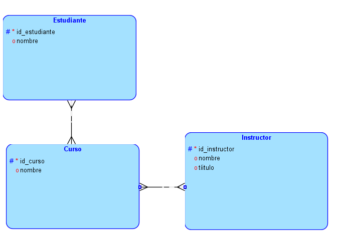
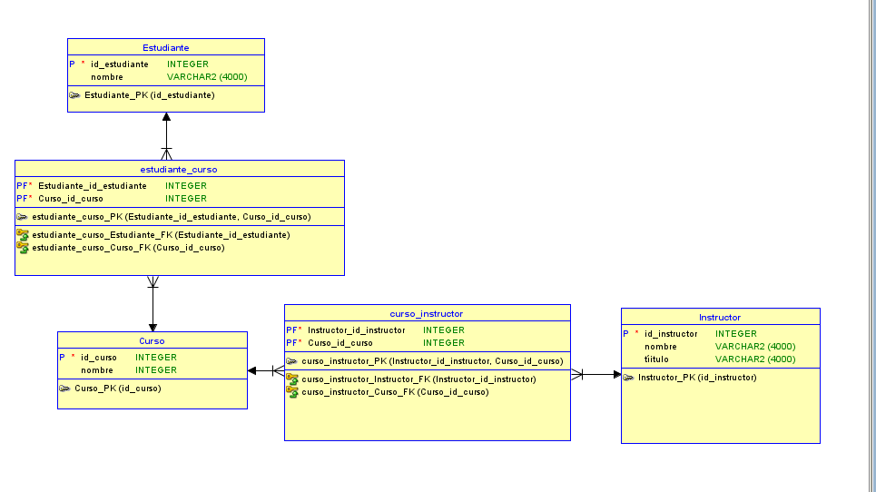
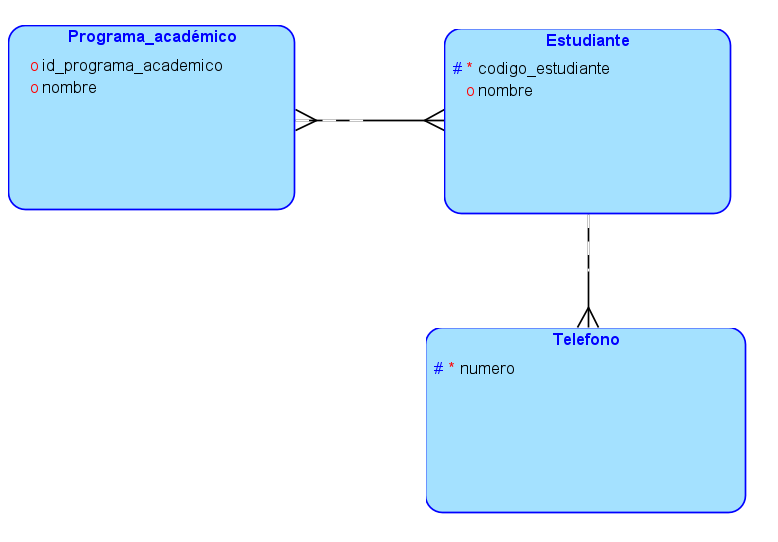
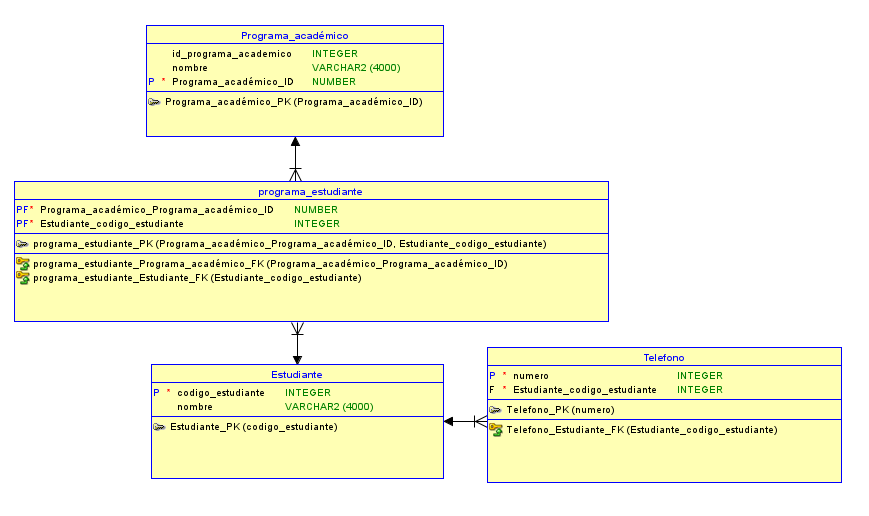

# Taller 14
## Punto 1 
### 1. La información repetida es:

Curso: "Inglés Básico" aparece en tres registros y "Excel Avanzado" aparece en dos registros.
Instructor: "Carlos Pérez" se repite tres veces y "Laura Gómez" se repite dos veces.

### 2. La redundancia puede ocasionar los siguientes problemas:

Desperdicio de espacio: Se almacena la misma información varias veces.
Inconsistencia de datos: Si cambia el nombre de un instructor, debe actualizarse en todos los registros. Si se olvida alguno, habrá información diferente para el mismo instructor.
Mayor riesgo de errores: Al ingresar los datos manualmente pueden escribirse nombres distintos para el mismo curso o instructor.
Mayor dificultad para el mantenimiento: Las actualizaciones requieren modificar varios registros en lugar de uno solo.

### 3.Para eliminar la redundancia de datos en la base de datos de la academia de idiomas, se realizó una normalización del modelo separando la información en entidades independientes y utilizando tablas intermedias para representar las relaciones muchos a muchos.

Se identificaron tres entidades principales:

Estudiante
Curso
Instructor

Debido a que:

Un estudiante puede estar en varios cursos.
Un curso puede tener varios estudiantes.
Un instructor puede dictar varios cursos.
Un curso puede ser dictado por varios instructores.

Se crearon dos tablas intermedias:

estudiante_curso → para representar la relación entre estudiantes y cursos.
curso_instructor → para representar la relación entre cursos e instructores.**

### 3 y 4. 

## Punto 2

## Punto 3
La combinación de las tablas se realiza mediante una operación JOIN, que permite relacionar registros de dos o más tablas utilizando una columna en común.

