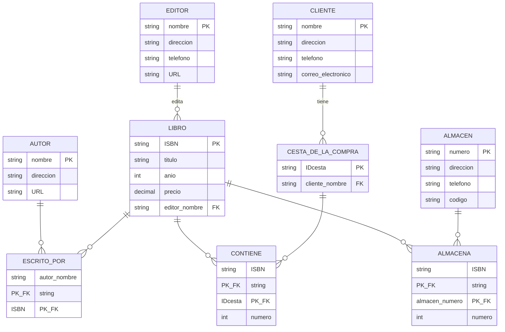
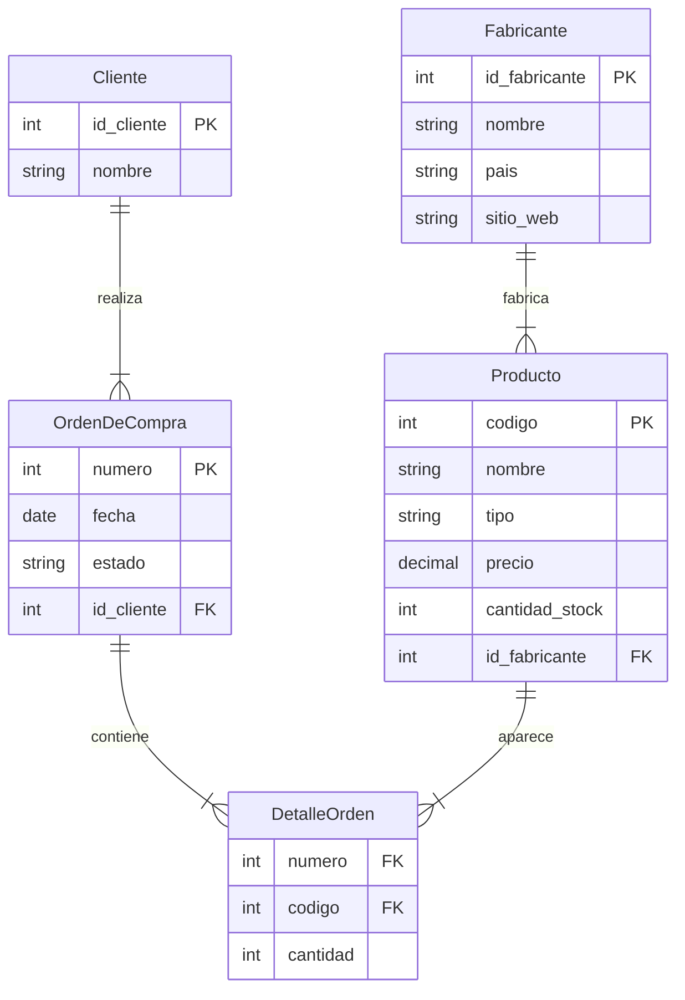
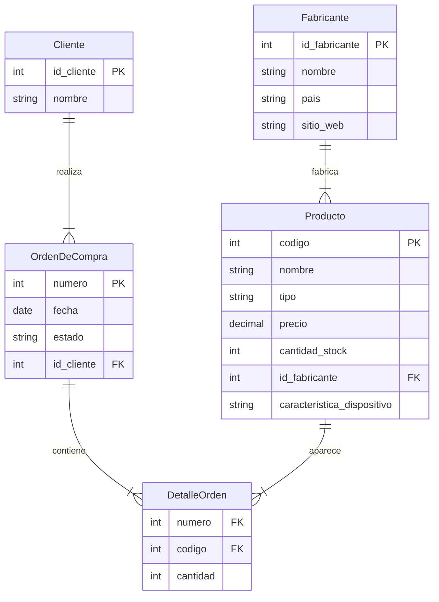
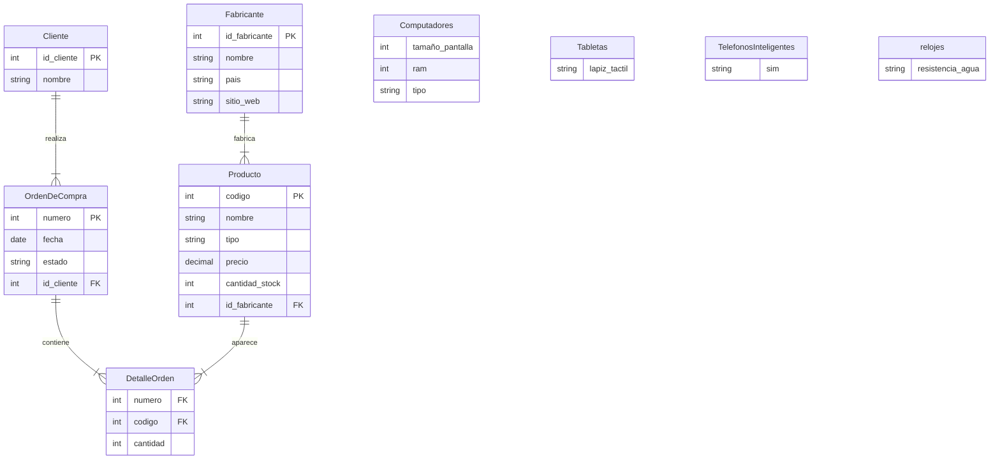

# Taller Trabajo en pareja 

## Actividad

### Segundo punto

```mermaid
erDiagram
  AUTOR ||--o{ ESCRITO_POR : ""
  LIBRO ||--o{ ESCRITO_POR : ""
  EDITOR ||--o{ LIBRO : "edita"
  LIBRO ||--o{ CONTIENE : ""
  CESTA_DE_LA_COMPRA ||--o{ CONTIENE : ""
  CLIENTE ||--o{ CESTA_DE_LA_COMPRA : "tiene"
  LIBRO ||--o{ ALMACENA : ""
  ALMACEN ||--o{ ALMACENA : ""

  AUTOR {
    string nombre PK
    string direccion
    string URL
  }
  EDITOR {
    string nombre PK
    string direccion
    string telefono
    string URL
  }
  LIBRO {
    string ISBN PK
    string titulo
    int anio
    decimal precio
    string editor_nombre FK
  }
  ESCRITO_POR {
    string autor_nombre PK_FK
    string ISBN PK_FK
  }
  CLIENTE {
    string nombre PK
    string direccion
    string telefono
    string correo_electronico
  }
  CESTA_DE_LA_COMPRA {
    string IDcesta PK
    string cliente_nombre FK
  }
  CONTIENE {
    string ISBN PK_FK
    string IDcesta PK_FK
    int numero
  }
  ALMACEN {
    string numero PK
    string direccion
    string telefono
    string codigo
  }
  ALMACENA {
    string ISBN PK_FK
    string almacen_numero PK_FK
    int numero
  }
```

## Ejercicio propuesto

### Punto a 

```mermaid
erDiagram
    Fabricante {
        int id_fabricante PK
        string nombre
        string pais
        string sitio_web
    }

    Producto {
        int codigo PK
        string nombre
        string tipo
        decimal precio
        int cantidad_stock
        int id_fabricante FK
    }

    Cliente {
        int id_cliente PK
        string nombre
    }

    OrdenDeCompra {
        int numero PK
        date fecha
        string estado
        int id_cliente FK
    }

    DetalleOrden {
        int numero FK
        int codigo FK
        int cantidad
    }


    Fabricante ||--|{ Producto : fabrica
    Cliente ||--|{ OrdenDeCompra : realiza
    OrdenDeCompra ||--|{ DetalleOrden : contiene
    Producto ||--|{ DetalleOrden : aparece
```

### Punto b

```mermaid
erDiagram
    Fabricante {
        int id_fabricante PK
        string nombre
        string pais
        string sitio_web
    }

    Producto {
        int codigo PK
        string nombre
        string tipo
        decimal precio
        int cantidad_stock
        int id_fabricante FK
        string caracteristica_dispositivo
    }

    Cliente {
        int id_cliente PK
        string nombre
    }

    OrdenDeCompra {
        int numero PK
        date fecha
        string estado
        int id_cliente FK
    }

    DetalleOrden {
        int numero FK
        int codigo FK
        int cantidad
    }


    Fabricante ||--|{ Producto : fabrica
    Cliente ||--|{ OrdenDeCompra : realiza
    OrdenDeCompra ||--|{ DetalleOrden : contiene
    Producto ||--|{ DetalleOrden : aparece
```

### Punto c

```mermaid
erDiagram
    Fabricante {
        int id_fabricante PK
        string nombre
        string pais
        string sitio_web
    }

    Producto {
        int codigo PK
        string nombre
        string tipo
        decimal precio
        int cantidad_stock
        int id_fabricante FK
    }

    Cliente {
        int id_cliente PK
        string nombre
    }

    OrdenDeCompra {
        int numero PK
        date fecha
        string estado
        int id_cliente FK
    }

    DetalleOrden {
        int numero FK
        int codigo FK
        int cantidad
    }

	Computadores {
        int tamaño_pantalla
		int ram
		string tipo
    }

	Tabletas {
        string lapiz_tactil
    }

	TelefonosInteligentes {
        string sim
    }

	relojes {
        string resistencia_agua
		
    }


    Fabricante ||--|{ Producto : fabrica
    Cliente ||--|{ OrdenDeCompra : realiza
    OrdenDeCompra ||--|{ DetalleOrden : contiene
    Producto ||--|{ DetalleOrden : aparece
```
