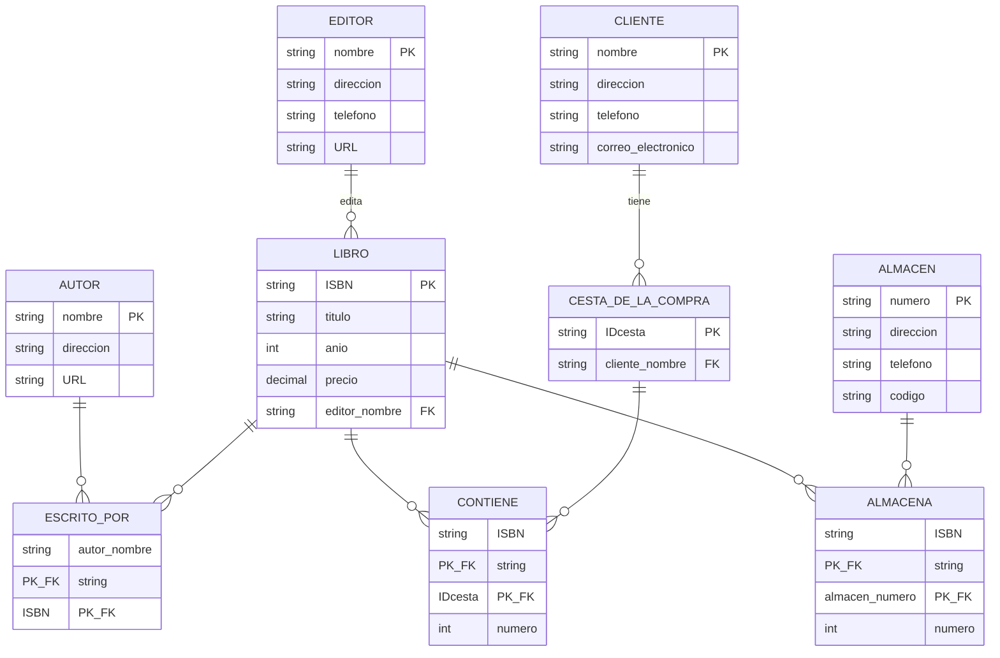
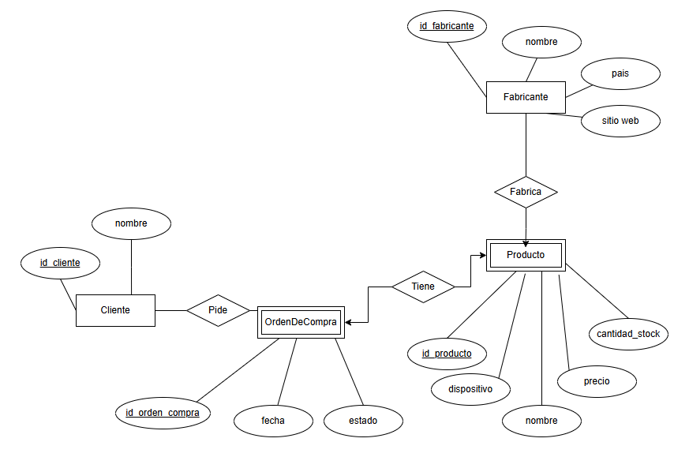
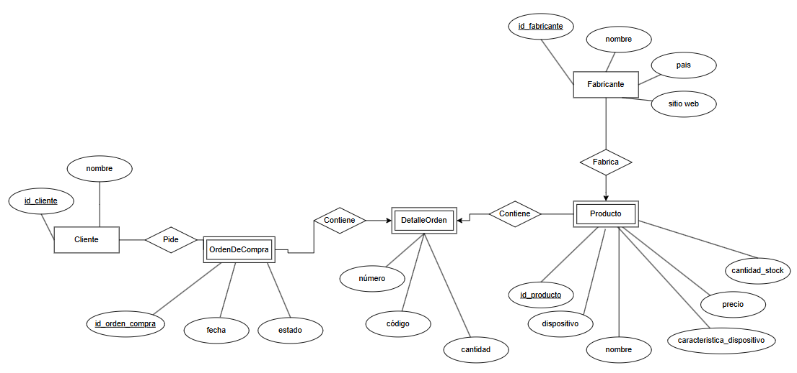
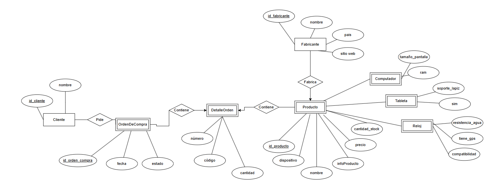
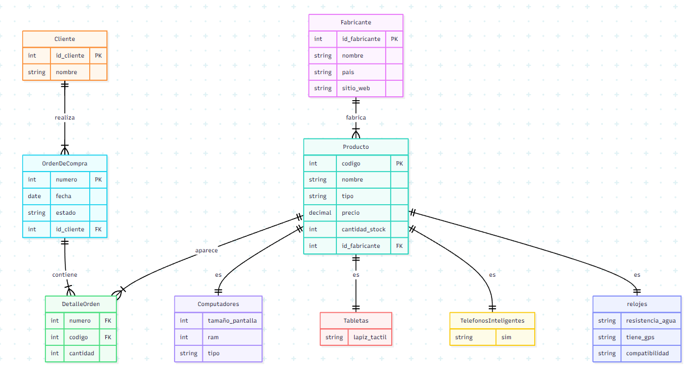

# Taller Trabajo en pareja 

## Actividad

### Segundo punto

```mermaid
erDiagram
  AUTOR ||--o{ ESCRITO_POR : ""
  LIBRO ||--o{ ESCRITO_POR : ""
  EDITOR ||--o{ LIBRO : "edita"
  LIBRO ||--o{ CONTIENE : ""
  CESTA_DE_LA_COMPRA ||--o{ CONTIENE : ""
  CLIENTE ||--o{ CESTA_DE_LA_COMPRA : "tiene"
  LIBRO ||--o{ ALMACENA : ""
  ALMACEN ||--o{ ALMACENA : ""

  AUTOR {
    string nombre PK
    string direccion
    string URL
  }
  EDITOR {
    string nombre PK
    string direccion
    string telefono
    string URL
  }
  LIBRO {
    string ISBN PK
    string titulo
    int anio
    decimal precio
    string editor_nombre FK
  }
  ESCRITO_POR {
    string autor_nombre PK_FK
    string ISBN PK_FK
  }
  CLIENTE {
    string nombre PK
    string direccion
    string telefono
    string correo_electronico
  }
  CESTA_DE_LA_COMPRA {
    string IDcesta PK
    string cliente_nombre FK
  }
  CONTIENE {
    string ISBN PK_FK
    string IDcesta PK_FK
    int numero
  }
  ALMACEN {
    string numero PK
    string direccion
    string telefono
    string codigo
  }
  ALMACENA {
    string ISBN PK_FK
    string almacen_numero PK_FK
    int numero
  }
```

## Ejercicio propuesto

### Punto a 

### Punto b

### Punto c

