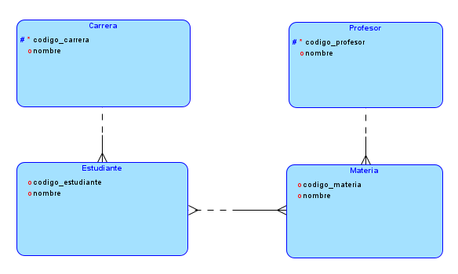
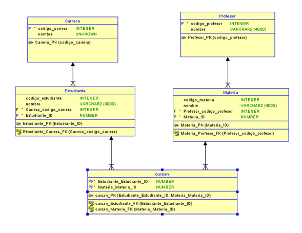

# Lectura: Descomposición de Relaciones en Bases de Datos 

## Tema 1. Primera Forma Normal (1FN) 

### Ejercicio 1

#### 1. Explique por qué la tabla no cumple con la Primera Forma Normal (1FN).  

El atributo Idiomas contiene varios valores en una sola celda. Los valores no son atómicos, por lo tanto, la tabla no está en **Primera Forma Normal**.

#### 2. Transforme la tabla para que cumpla con la 1FN.  

|Código |	Estudiante |	Idiomas | 
| :---: | :---: | :---: |
|E001 |	Laura |	Inglés|
|E001 |	Laura |	Francés|
|E002 |	Andrés |	Inglés| 
|E003 |	Sofía |	Alemán |
|E003 |	Sofía |	Italiano|
|E003 |	Sofía |	Portugués| 

#### 3. Identifique cuáles fueron los cambios realizados.

En este caso los cambios que se hicieron fueron, fue que ahora cada celda tiene un solo valor, no como antes donde en la misma celda había muchos valores. Ahora los valores son **atomicos**.

### Ejercicio 2

#### 1. Identifique el problema de diseño.  

El atributo Productos contiene varios valores en una sola celda. Los valores no son atómicos, por lo tanto, la tabla no está en **Primera Forma Normal**.

#### 2. Convierta la tabla a Primera Forma Normal.  

| Factura |	Cliente 	| Productos |
| :---: | :---: | :---: |
|F001| 	Juan |	Mouse|
|F001| 	Juan |	Teclado| 
|F002| 	Ana |	Monitor |
|F003| 	Carlos |	Laptop |
|F003| 	Carlos |	Impresora |
|F003| 	Carlos | Cámara |

#### 3. Explique por qué el nuevo diseño es mejor.  

Ahora cada celda tiene un solo valor, no como antes donde en la misma celda habían muchas valores. Ahora los valores con **atomicos**.

## Tema 2. Dependencias Funcionales 

### Ejercicio 1

#### 1. Identifique las dependencias funcionales existentes.  

La dependencia funcional principal es:

- El **Código_Estudiante** determina el **Nombre**. 
-	El **Código_Estudiante** determina el **Programa**.

Esto ocurre porque cada estudiante tiene un código único que identifica toda su información.

#### 2. Escriba las dependencias utilizando la notación con flechas (→).  

Las dependencias funcionales son:

-	**Código_Estudiante → Nombre**
-	**Código_Estudiante → Programa** 

#### 3. Justifique por qué existen esas dependencias.  

- **Código_Estudiante → Nombre:** Cada código de estudiante es único y corresponde a un solo estudiante, por lo que al conocer el código se conoce exactamente su nombre. 
- **Código_Estudiante → Programa:** Cada estudiante registrado tiene asociado un único programa académico. Por ello, conociendo el código del estudiante se puede determinar el programa al que pertenece.

### Ejercicio 2

#### 1. Determine qué atributos dependen funcionalmente del Código_Producto.  

Las dependencias funcionales son:
-	**Código_Producto → Producto** 
-	**Código_Producto → Precio**
-	**Código_Producto → Proveedor**

#### 2. Indique una dependencia que no se cumpla.  

Una dependencia que no se cumple es:
-	**Proveedor → Producto**

#### 3. Explique el motivo.  

La dependencia **Proveedor → Producto** no es válida porque un mismo proveedor puede suministrar varios productos diferentes.

## Tema 3. Problemas de un Mal Diseño de Bases de Datos 

### Ejercicio 1

#### 1. Identifique la información repetida.  

En la tabla se repiten varios datos:
-	Para el Código 1001, se repiten:
     -	Estudiante: Ana
     -	Carrera: Ingeniería 
-	La materia Bases de Datos aparece en dos registros. 
-	El docente Carlos Gómez aparece en dos registros. 

#### 2. Explique qué problemas pueden presentarse al actualizar la información.  

Al almacenar toda la información en una sola tabla pueden presentarse varios problemas:
-	**Inconsistencia de datos:** Si Ana cambia de carrera, habría que actualizar todas las filas donde aparece. Si se olvida alguna, existirán datos diferentes para el mismo estudiante. 
- **Anomalía de actualización:** Cambiar el nombre de un docente requiere modificar todas las filas donde esté registrado. 
-	**Mayor riesgo de errores:** Al repetir la misma información muchas veces, aumenta la posibilidad de escribir datos diferentes o incorrectos.

#### 3. Mencione al menos tres desventajas de este diseño.  

-	**Redundancia de datos:** La información de estudiantes, carreras y docentes se almacena repetidamente. 
-	**Mayor consumo de espacio:** Al repetir datos innecesariamente, la base de datos ocupa más almacenamiento. 
-	**Anomalías de actualización:**  Es necesario modificar varias filas para actualizar un solo dato. 
-	**Anomalías de inserción:** No se puede registrar un estudiante o un docente si aún no está asociado a una materia. 
- **Anomalías de eliminación:** Si se elimina la última materia de un estudiante, también podría perderse toda su información personal.

### Ejercicio 2

#### 1. Identifique la redundancia existente.  
En la tabla se observa que hay varios datos repetidos:
- El médico “Pedro Ruiz” se repite en todas las filas. 
- Su especialidad “Cardiología” también se repite junto con cada paciente. 
- La relación médico–especialidad se repite innecesariamente en cada registro. 
- Incluso el médico aparece asociado a múltiples pacientes, repitiendo siempre la misma información de base. 
- La redundancia principal está en los datos del médico y su especialidad.

#### 2. Explique qué ocurriría si cambia la especialidad del médico.  

Si la especialidad de Pedro Ruiz cambia (por ejemplo, de Cardiología a Medicina Interna), habría que modificarla en todas las filas donde aparece.

#### 3. ¿Cómo afectaría esto la consistencia de los datos?  

- Podrían existir registros donde el mismo médico tenga dos especialidades diferentes. 
- Se generaría inconsistencia de datos, ya que la información no sería uniforme en toda la tabla.

## Tema 4. Descomposición de Relaciones 

### Ejercicio 1

#### 1. Identifique la redundancia.  

En la tabla se observa redundancia porque varios datos se repiten innecesariamente:

- El estudiante “Ana (1001)” se repite en dos filas porque está inscrita en más de una materia.
- Su nombre y carrera (Ingeniería) también se repiten cada vez que aparece.
- El estudiante “Juan (1002)” también repite su información.
- La materia “Bases de Datos (BD101)” se repite en más de una fila porque varios estudiantes la cursan.
- El profesor “Carlos Gómez” se repite cada vez que aparece la materia BD101.

#### 2. Descomponga la tabla en varias relaciones.  

Tabla estudiante
|Código_estudiante|	nombre	|carrera|
| :---: | :---: | :---: |
|1001 |	Ana |	Ingeniería |
|1002 |	Juan |	Sistemas |

Tabla carrera
|Codigo_carrera|	carrera|
| :---: | :---: |
|1	|Ingeniería |
|2	|Sistemas |

Tabla profesor
|Código_profesor|	Profesor|
| :---: | :---: |
|1	|Carlos Gómez| 
|2	|Luis Pérez| 

Tabla materia
|Código_materia|	Materia|	Codigo_profesor|
| :---: | :---: | :---: |
|BD101| 	Bases de Datos| 	1|
|PR201| 	Programación| 	2|

Inscripción
|Código_estudiante|	Codigo_materia|
| :---: | :---: |
|1001 |	BD101 |
|1002 |	BD101 |

#### 3. Dibuje el esquema relacional resultante.  

### Ejercicio 2

#### 1.¿Qué información se encuentra repetida?  

En la tabla se repiten varios datos debido a que un empleado puede estar asignado a más de un proyecto:
•	El empleado “Laura” se repite en dos filas porque está asignada a dos proyectos. 
•	El departamento “Ventas” se repite asociado a Laura en ambas filas. 
•	La ciudad “Bogotá” también se repite porque está asociada al mismo empleado y departamento. 
•	En general, la combinación (Empleado, Departamento, Ciudad) se repite cuando el empleado tiene múltiples proyectos.

#### 2. Proponga una descomposición de la tabla.  

Tabla empleado
|id_empleado|	nombre|	Id_departamento|
| :---: | :---: | :---: |
|1|	Laura|	001|
|2|	Carlos|	002|

Tabla departamento 
|Id_departamento|	nombre|	Id_ciudad|
| :---: | :---: | :---: |
|001|	Bogota|	011|
|002|	Medellin|	022|

Tabla ciudad
|Id_ciudad|	Nombre|
| :---: | :---: |
|011|	Bogota|
|022|	Medellin|

Tabla proyecto
|Id_proyecto|	Nombre_proyecto|
| :---: | :---: |
|0001|	Proyecto A|
|0002|	Proyecto B |
|0003|	Proyecto C|

Trabaja_en 
|Id_empleado|	Id_proyecto|
| :---: | :---: |
|1|	0001|
|1|	0002|
|2|	0003|

#### 3. Explique cómo se relacionan las nuevas tablas.  

La tabla EMPLEADO se relaciona con DEPARTAMENTO mediante id_departamento. 
La tabla DEPARTAMENTO se relaciona con CIUDAD mediante id_ciudad. 
La tabla PROYECTO contiene los proyectos disponibles de forma independiente. 
La relación entre EMPLEADO y PROYECTO se establece mediante la tabla intermedia TRABAJA_EN, que conecta: 
- id_empleado
- id_proyecto

#### 4. Indique los beneficios obtenidos con la descomposición.

- Elimina la redundancia, ya que los datos de empleados, departamentos, ciudades y proyectos no se repiten en cada fila. 
- Reduce inconsistencias, porque si cambia un dato (por ejemplo, el nombre de un departamento), solo se actualiza en una tabla.

## Tema 5. Descomposición sin pérdida y Conservación de Dependencias 

### Ejercicio 1
#### 1. Proponga una descomposición en dos tablas.  

Tabla 1. Curso
|Código curso|	Curso|
| :---: | :---: |
|BD101 	|Bases de Datos| 
|PR201| 	Programación| 

Tabla 2 . Informacion_Curso
|Código curso|	Aula| Docente|
| :---: | :---: |:---:|
|BD101 	|401 	|Carlos Gómez |
|PR201 	|305	|Luis Pérez |

#### 2. Explique si la información puede recuperarse mediante una operación JOIN.  

Sí. La información puede recuperarse realizando un JOIN entre las dos tablas utilizando la columna Código_Curso, ya que este atributo está presente en ambas tablas

#### 3. ¿Se trata de una descomposición sin pérdida? Justifique.  

Sí, es una descomposición sin pérdida, porque al unir las dos tablas mediante Código_Curso se recuperan exactamente los mismos datos de la relación original

### Ejercicio 2

#### 1. Descomponga la relación en tablas más pequeñas.  

Tabla libro
|Codigo_libro|	Libro|	Código_autor|	Codigo_editorial|
| :---: | :---: |:---:|:---:|
|L001 	|Base de datos|	1|	100|
|L002	|Java|	2|	101|

Tabla editorial
|Codigo_editorial |	Editorial |
| :---: | :---: |
|100 |	Alfaomega |
|101	|McGraw-Hill|

Tabla Autor
|Codigo_autor|	Autor|
| :---: | :---: |
|1	|Silberschatz|
|2	|Deitel |

#### 2. Indique si las dependencias funcionales se conservan.  

Sí, las dependencias funcionales se conservan.La dependencia funcional original es: Código_Libro → Libro, Editorial, Autor Después de la descomposición, Código_Libro sigue identificando de forma única el libro y, mediante las claves foráneas Código_Autor y Código_Editorial, también permite identificar el autor y la editorial correspondientes. Por lo tanto, la dependencia funcional original se mantiene.

#### 3. Explique por qué esta descomposición mejora el diseño.  

Esta descomposición mejora el diseño porque:
- Elimina la redundancia de datos, ya que la información de los autores y las editoriales se almacena una sola vez. 
- Reduce las inconsistencias, porque si cambia el nombre de un autor o de una editorial, solo es necesario actualizar un registro.

## Pregunta de reflexión 

### ¿Por qué la normalización y la descomposición son fundamentales para diseñar bases de datos eficientes? Mencione al menos cuatro beneficios y apoye su respuesta con un ejemplo. 

La **normalización** y la **descomposición** son fundamentales porque organizan los datos de forma eficiente y reducen problemas en la base de datos.

**Beneficios:**

1. Eliminan la redundancia de datos.
2. Evitan anomalías de inserción, actualización y eliminación.
3. Mejoran la integridad y consistencia de la información.
4. Facilitan el mantenimiento y la escalabilidad de la base de datos.

**Ejemplo:**
En lugar de guardar el nombre del estudiante en cada registro de materias, se crea una tabla **Estudiante** y otra **Matrícula**. Así, si el estudiante cambia de nombre, solo se actualiza una vez y la información permanece consistente.
